# 🏥 MEDEUON — Smart Clinic & Real-Time OPD Queue Management System

<div align="center">


<p align="center">
  <b>An enterprise-grade, full-stack hospital outpatient department (OPD) queue engine, clinical electronic health record (EHR) platform, and practice management ERP built on Spring Boot 3 & modern web technologies.</b>
</p>

[Key Features](#-key-features) • [Screenshots](#-visual-walkthrough--screenshots) • [Architecture](#-system-architecture) • [API Reference](#-api-endpoints-reference) • [Getting Started](#-getting-started) • [Team](#-project-team)

</div>

---

## 📖 Overview

**MEDEUON** replaces chaotic, paper-based hospital queueing with a real-time, deterministic token scheduling algorithm and unified clinical workflow engine. Designed for clinics, hospitals, and outpatient departments, it synchronizes patient appointments, lobby TV display screens, doctor clinical workstations, pharmacy stock deductions, diagnostic pathology lab orders, and administrative governance in real time.

```
       [ Patient Portals & Kiosks ]             [ Lobby TV Display Board ]
                   │                                         │
                   ▼                                         ▼
   ┌─────────────────────────────────────────────────────────────────┐
   │             Spring Boot 3 REST API & JWT Security Engine        │
   └─────────────────────────────────────────────────────────────────┘
         │                   │                     │             │
         ▼                   ▼                     ▼             ▼
  [ Doctor Desk ]    [ Reception Desk ]    [ Pharmacy Stock ]  [ Admin ]
```

---

## ✨ Key Features

### 1. 👥 Patient Experience & Self-Service
* **Interactive 3-Step Booking Wizard**: Filter specialists by department, view credentials and ratings, and schedule consultation slots with instant token allocation.
* **Leaflet.js GIS Clinic Locator**: Interactive map displaying clinic branches with real-time OPD waiting times, emergency facilities, and driving directions.
* **AI Medical Triage Chatbot**: Intelligent symptom checker assisting patients with preliminary triage and department recommendations.
* **Live Mobile Queue Tracker**: Real-time position tracking with dynamic countdown timers and room callouts.
* **Touchscreen Kiosks & QR Check-In**: Self-service token generation kiosks (`generate-token.html`) and contactless QR entrance check-in (`queue-checkin.html`).

### 2. 📺 Hospital Lobby OPD Display Board
* **High-Contrast "Now Serving" Counter**: Massive token callouts (#024 Now Serving) designed for large wall-mounted displays.
* **Multi-Doctor Counter Grid**: Side-by-side active consultation counters with status badges (*In Consultation*, *Next Calling*, *Counter Free*).
* **Live Announcement Ticker**: Real-time scrolling broadcast ticker powered by `/api/notice` for hospital-wide announcements.
* **QR Sync**: On-screen QR code allowing patients to mirror queue numbers on their phones.

### 3. 🩺 Doctor Clinical Workstation & EHR
* **1-Click Queue Controls**: **Call Next Patient**, **Recall Token**, and **Skip Absent Patient** with zero UI lag.
* **Complete Patient EHR History**: Vital signs tracker (BP, Pulse, Temp, SpO2), past consultation timelines, and allergy records.
* **Standardized ICD-10 Diagnostics**: Integrated diagnostic catalog lookup for standardized clinical records.
* **Smart E-Prescriptions**: Live medicine search autocomplete connected to clinic pharmacy inventory with automatic stock deduction.
* **Diagnostic Pathology Suite**: Direct test requisitioning (CBC, Lipid Profile, Biochemistry, Radiology) and integrated PDF lab report viewer.

### 4. 🛎️ Front-Desk Reception & Triage
* **Rapid Walk-In Registration**: One-click token dispenser for walk-in arrivals with automated doctor load balancing.
* **Identity Verification Modal**: Interactive popup verifying arriving patients and dispatching them into doctor queues.

### 5. 💊 Pharmacy Inventory & Billing Ledger
* **Live Stock Tracking**: Real-time medicine stock decrements with threshold alerts (*In Stock*, *Low Stock*, *Out of Stock*).
* **Invoicing & Cash Register**: Multi-mode payment ledger (Cash, UPI/QR, Card) with daily auditing summaries.

### 6. 🛡️ Executive Admin Governance
* **Doctor Credential Verification**: Review queue for practitioner licenses and medical council IDs with 1-click **Approve** / **Suspend** actions.
* **Executive Analytics**: Real-time KPI dashboards visualizing patient footfall, doctor throughput, queue clearance rates, and revenue.
* **Master Patient Registry**: Comprehensive hospital information system (HIS) patient directory.

---

## 🖥️ Visual Walkthrough & Screenshots

| Screen | Preview | Description |
| :---: | :--- | :--- |
| **01** | 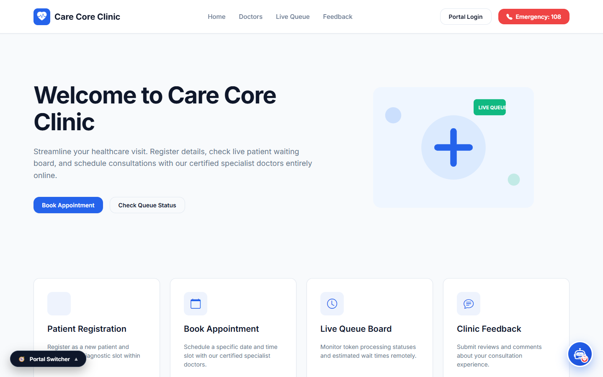 | **Main Public Landing & Booking**: Primary portal hero with wait times, doctor directory, and booking actions. |
| **02** |  | **Modern Healthcare Showcase**: Alternate homepage variant with departmental cards and doctor ratings. |
| **03** | 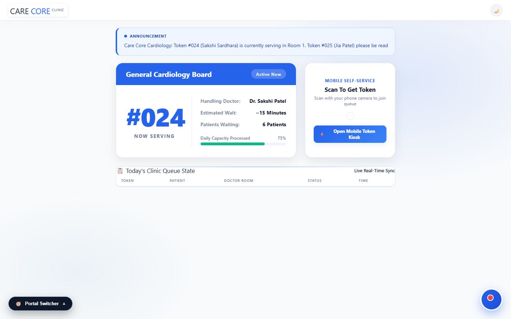 | **Live Waiting Room TV Display**: Wall-mounted TV screen with Now Serving highlights and broadcast ticker. |
| **04** | 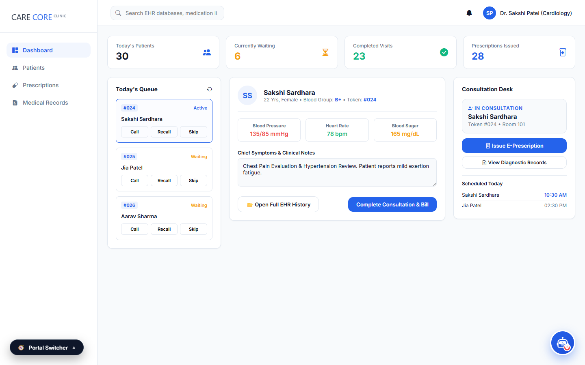 | **Doctor Consultation Desk**: Real-time queue action desk (Call Next, Skip, Recall) and daily KPI summary. |
| **05** | 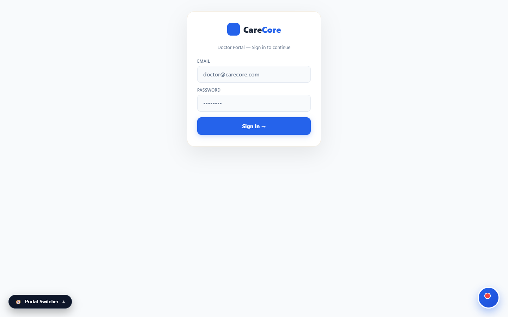 | **Clinical EHR & Examination Desk**: Patient vitals, ICD-10 diagnostic codes, and digital prescription pad. |
| **06** | 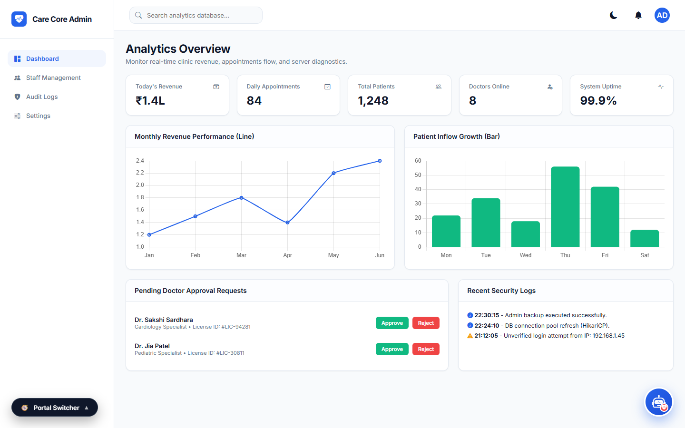 | **Executive Hospital Portal**: Hospital director analytics, doctor approvals, revenue KPIs, and registries. |
| **07** | 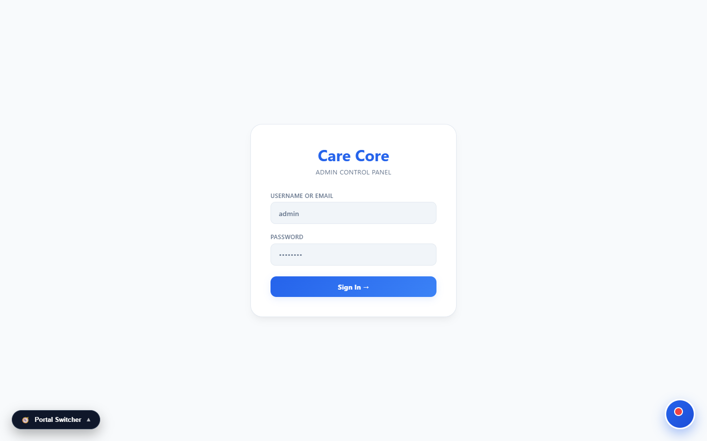 | **Admin Regulatory Desk**: Medical council license inspection and doctor service suspension controls. |
| **08** | 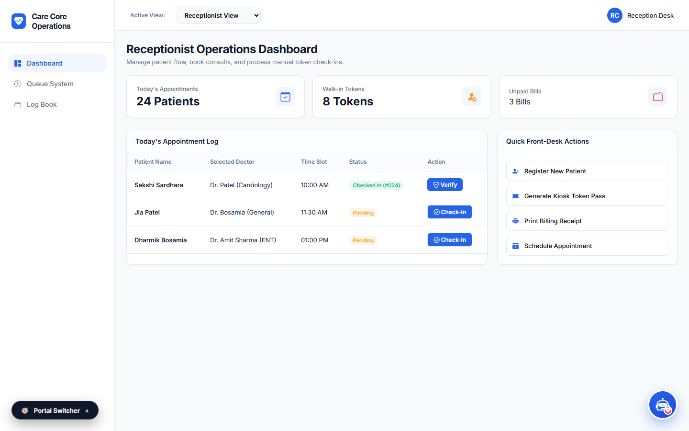 | **Receptionist Front Desk**: Front-office walk-in check-in, load balancing, and token dispensing terminal. |
| **09** | 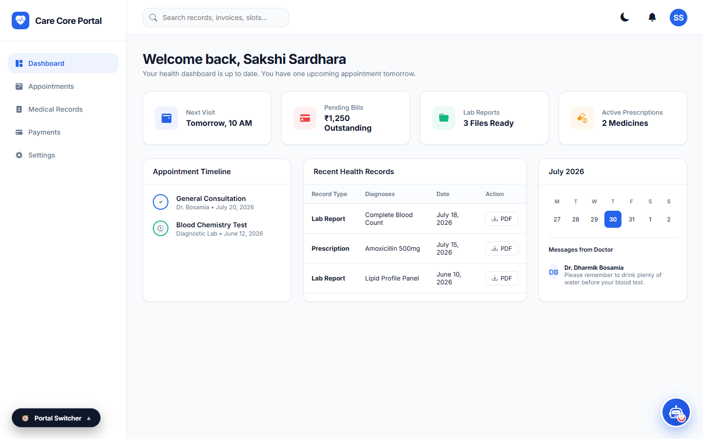 | **Patient Live Queue Tracker**: Mobile self-tracking queue position, remaining minutes, and room indicator. |
| **10** | 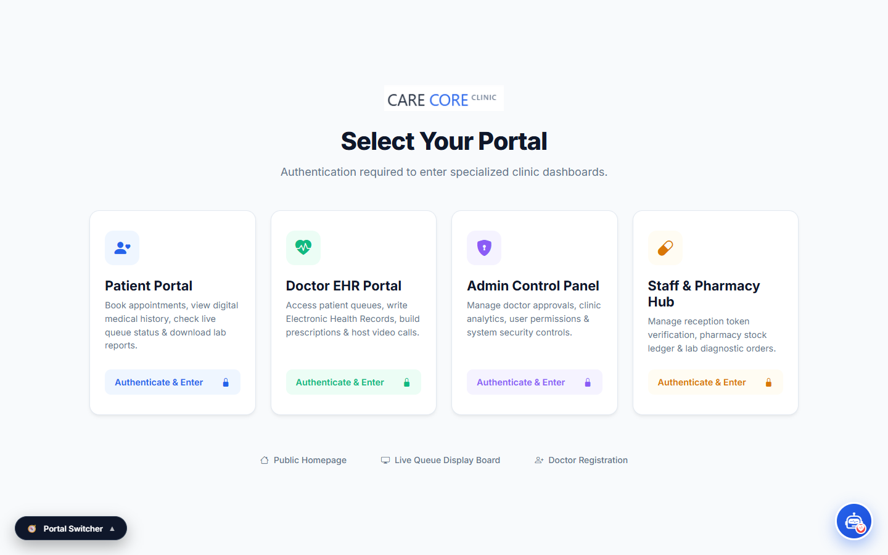 | **Patient Self-Service Kiosk**: Lobby terminal for real-time doctor availability and walk-in token issuance. |
| **11** | 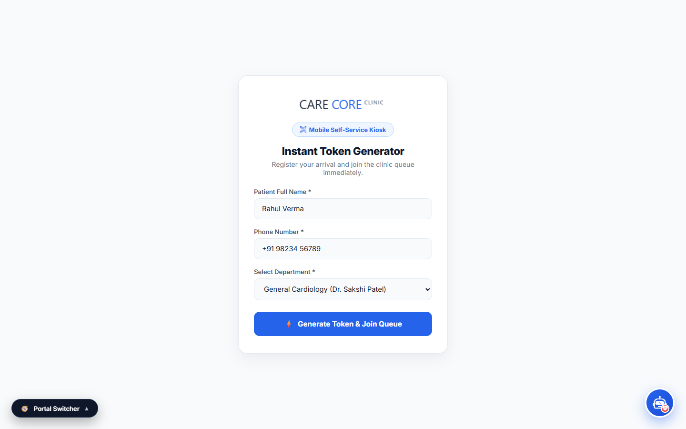 | **Touchscreen Token Kiosk**: Standalone entry lobby kiosk interface for rapid patient token dispensing. |
| **12** | 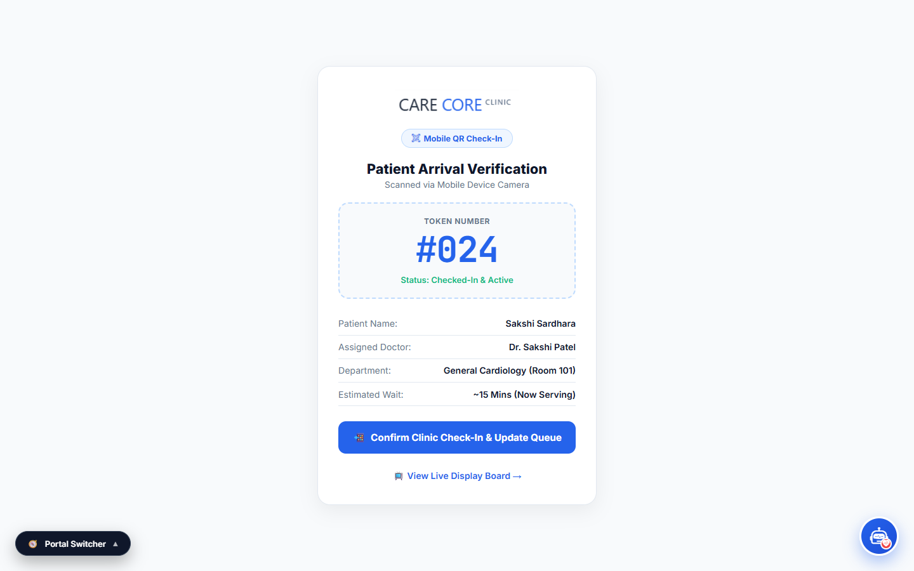 | **Contactless QR Check-In**: Mobile entrance QR scanner to automatically transition booked patients to waiting. |
| **13** | 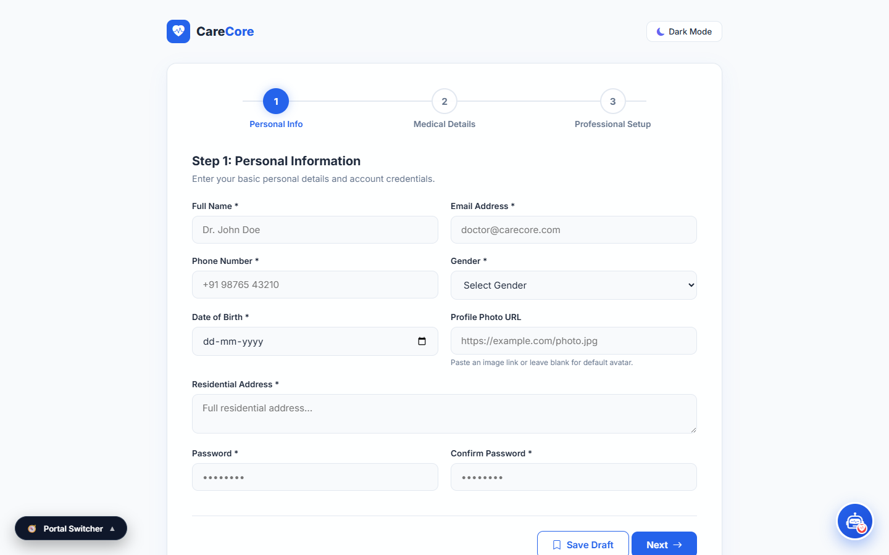 | **Doctor Onboarding Portal**: Secure practitioner registration with medical council verification workflow. |
| **14** | 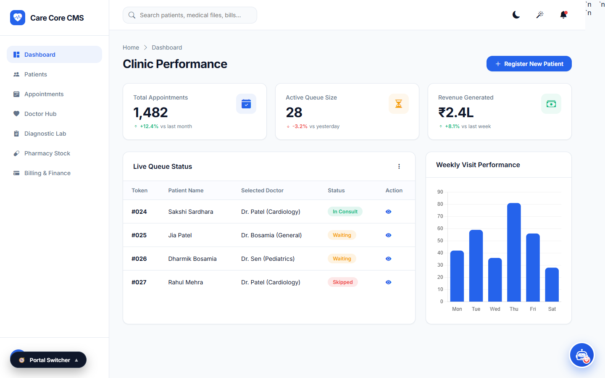 | **Executive Analytics Dashboard**: Hospital departmental workload heatmaps, queue clearance, and billing ledger. |
| **15** | 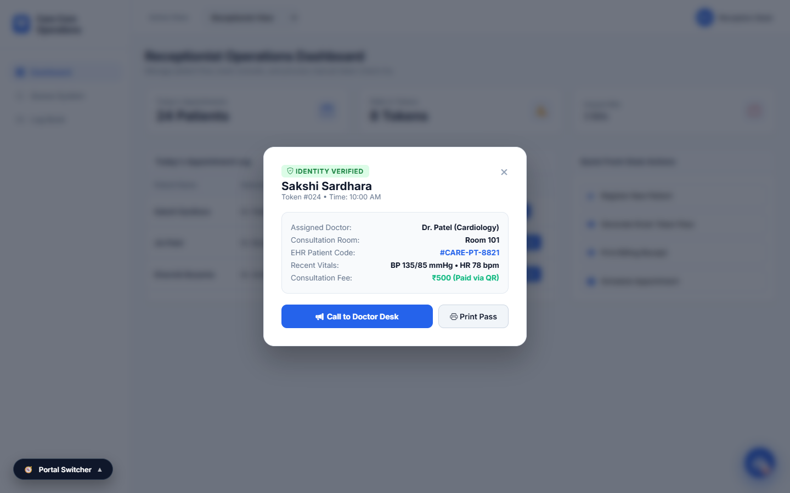 | **Patient Verification Modal**: Interactive dialog verifying patient identity and dispatching live tokens. |

---

## 🏗️ System Architecture

MEDEUON follows the industry-standard **Layered Enterprise Architecture** with strict Role-Based Access Control (RBAC):

```
┌────────────────────────────────────────────────────────────────────────┐
│                        FRONTEND PRESENTATION LAYER                     │
│   HTML5 • Glassmorphism CSS3 • Vanilla ES6+ JS • Leaflet.js Maps      │
└────────────────────────────────────┬───────────────────────────────────┘
                                     │  REST API / JSON Payloads
                                     ▼
┌────────────────────────────────────────────────────────────────────────┐
│                     SPRING SECURITY & JWT FILTER                       │
│    JwtAuthFilter ➔ HMAC-SHA256 Token Validator ➔ SecurityContext       │
│    Roles: ROLE_ADMIN  │  ROLE_DOCTOR  │  ROLE_PATIENT                  │
└────────────────────────────────────┬───────────────────────────────────┘
                                     │
                                     ▼
┌────────────────────────────────────────────────────────────────────────┐
│                        REST CONTROLLER LAYER                           │
│  AuthController • DoctorController • AdminController • PublicQueueCtrl │
│  AppointmentCtrl • BillingController • InventoryCtrl • LabController  │
└────────────────────────────────────┬───────────────────────────────────┘
                                     │
                                     ▼
┌────────────────────────────────────────────────────────────────────────┐
│                        SERVICE & REPOSITORY LAYER                      │
│     Spring Data JPA Repositories • Transactional Integrity Controls    │
└────────────────────────────────────┬───────────────────────────────────┘
                                     │
                                     ▼
┌────────────────────────────────────────────────────────────────────────┐
│                        RELATIONAL DATABASE LAYER                       │
│     PostgreSQL / H2 In-Memory DB • Automatic Schema Seeding & Recovery │
└────────────────────────────────────────────────────────────────────────┘
```

---

## 🔌 API Endpoints Reference

### 🔐 Authentication & Accounts
| Method | Endpoint | Access | Description |
| :--- | :--- | :--- | :--- |
| `POST` | `/api/auth/login` | Public | Authenticates users and returns signed JWT token |
| `POST` | `/api/auth/admin/login` | Public | Admin login alias returning executive profile payload |
| `POST` | `/api/auth/register-doctor` | Public | Registers a new doctor awaiting admin verification |

### ⏱️ Queue Engine & Public Access
| Method | Endpoint | Access | Description |
| :--- | :--- | :--- | :--- |
| `GET` | `/api/queue/state` | Public | Returns real-time serving tokens and waiting queue depths |
| `POST` | `/api/queue/token` | Public | Generates the next sequential OPD token |
| `POST` | `/api/queue/next` | Doctor / Admin | Advances queue to next patient and marks active token |
| `POST` | `/api/queue/skip` | Doctor / Admin | Skips absent patient and logs status |
| `POST` | `/api/queue/recall` | Doctor / Admin | Recalls previously called token |
| `GET` | `/api/notice/get` | Public | Returns active hospital broadcast announcement ticker |
| `POST` | `/api/notice/set` | Doctor / Admin | Broadcasts a new announcement ticker |

### 🩺 Doctor Clinical Desk
| Method | Endpoint | Access | Description |
| :--- | :--- | :--- | :--- |
| `GET` | `/api/doctor/patients` | Doctor / Admin | Retrieves assigned consultation queue |
| `GET` | `/api/admin/patients/{id}/profile`| Doctor / Admin | Comprehensive patient EHR clinical history & vitals |
| `GET` | `/api/clinical-catalog` | Doctor / Admin | Standardized ICD-10 diagnostic code lookup |
| `GET` | `/api/doctor/templates` | Doctor / Admin | Predefined E-Prescription templates |
| `GET` | `/api/doctor/leaves` | Doctor / Admin | Doctor leave calendar & schedule availability |

### 💊 Pharmacy, Billing & Diagnostics
| Method | Endpoint | Access | Description |
| :--- | :--- | :--- | :--- |
| `GET` | `/api/inventory` | Doctor / Admin | Live pharmacy inventory stock levels |
| `GET` | `/api/inventory/prescription-items`| Doctor / Admin | Dynamic medicine search autocomplete |
| `GET` | `/api/bills` | Doctor / Admin | Clinic invoices and billing records |
| `POST`| `/api/bills/{id}/pay` | Doctor / Admin | Processes invoice payment (Cash / UPI / Card) |
| `GET` | `/api/lab/orders` | Doctor / Admin | Pathology & radiology diagnostic orders |
| `POST`| `/api/lab/orders` | Doctor / Admin | Places a new diagnostic lab requisition |

### 🛡️ Administration & Governance
| Method | Endpoint | Access | Description |
| :--- | :--- | :--- | :--- |
| `GET` | `/api/admin/analytics` | Admin | Real-time hospital revenue, queue throughput & metrics |
| `GET` | `/api/admin/doctors` | Admin | Master doctor registry with license numbers |
| `POST`| `/api/admin/doctors/{id}/approve` | Admin | Approves doctor application and enables booking |
| `POST`| `/api/admin/doctors/{id}/suspend` | Admin | Toggles doctor active/suspended status |
| `GET` | `/api/admin/patients` | Admin | Master patient index & registry |

---

## 🚀 Getting Started

### Prerequisites
* **Java Development Kit (JDK)**: Version 17 LTS or higher
* **Apache Maven**: 3.8+ (or use the included `./mvnw` wrapper)
* **Git**: Installed and configured

### 1. Clone the Repository
```bash
git clone https://github.com/Kevaldoshi123/JEE_Clinic_management.git
cd JEE_Clinic_management
```

### 2. Configure Database (Optional)
By default, the application runs on an embedded **H2 in-memory database** with automated demo data seeding. To connect to **PostgreSQL**, update `src/main/resources/application.properties`:
```properties
spring.datasource.url=jdbc:postgresql://localhost:5432/clinic_db
spring.datasource.username=postgres
spring.datasource.password=your_password
spring.jpa.hibernate.ddl-auto=update
```

### 3. Build & Run
```bash
# Using Maven Wrapper (Windows PowerShell)
.\mvnw spring-boot:run

# Using Maven Wrapper (Linux / macOS)
./mvnw spring-boot:run
```

### 4. Access the Application
Open your web browser and navigate to:
* **Main Portal**: [`http://localhost:8085`](http://localhost:8085)
* **Waiting Hall TV Display**: [`http://localhost:8085/display.html`](http://localhost:8085/display.html)
* **Doctor Consultation Portal**: [`http://localhost:8085/doctor_portal_design.html`](http://localhost:8085/doctor_portal_design.html)
* **Admin Executive Portal**: [`http://localhost:8085/admin_portal_design.html`](http://localhost:8085/admin_portal_design.html)
* **Receptionist Staff Portal**: [`http://localhost:8085/staff_portal_design.html`](http://localhost:8085/staff_portal_design.html)

---

## 🔑 Demo Login Credentials

The system includes a pre-seeded `DataLoader` with default accounts for testing:

| Portal | Username / Email | Password | Role |
| :--- | :--- | :--- | :--- |
| **Hospital Administrator** | `admin` / `admin@clinic.com` | `admin123` | `ROLE_ADMIN` |
| **Cardiology Specialist** | `dr.sharma@clinic.com` | `doctor123` | `ROLE_DOCTOR` |
| **Dermatology Specialist**| `dr.patel@clinic.com` | `doctor123` | `ROLE_DOCTOR` |
| **Orthopedics Specialist**| `dr.mehta@clinic.com` | `doctor123` | `ROLE_DOCTOR` |

---

## 👥 Project Team

This project was developed as a final year capstone project for **TY BSc.IT — Division A (Academic Year 2025–2026)**:

| Student Name | SAP ID | Class & Div | Technical Contribution |
| :--- | :---: | :---: | :--- |
| **Sakshi Sardhara** | `53013240010` | TY BSc.IT - A | Frontend Architecture, UI/UX Glassmorphism & Patient Portals |
| **Jia Patel** | `53013240016` | TY BSc.IT - A | Doctor Consultation Desk, E-Prescription Pad & Lab Diagnostics |
| **Dharmik Bosamia** | `53013240021` | TY BSc.IT - A | Database Schema Design, Spring Data JPA & Entity Data Seeding |
| **Keval Doshi** | `53013240009` | TY BSc.IT - A | Security (JWT/RBAC), Real-Time Queue Engine & System Integration |

---

## 📄 Documentation & Reports
Complete academic documentation and Word specifications are available in the [`docs/`](docs/) directory:
* **Academic Project Report (`.docx`)**: [`docs/Medeuon_Project_Report.docx`](docs/Medeuon_Project_Report.docx)

---

<div align="center">
  <b>MEDEUON Clinic Management System</b> • Built with ❤️ using Spring Boot & Java 17
</div>
